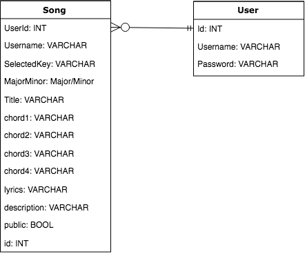

# Welcome to progressions


## What is progressions?


progressions is a songwriting application to help simplify the songwriting process for new guitarists by handling some of the music theory involved with chords and scales, so you can focus on writing songs that sound good.


## Usage
1. Clone or download the progressions repository to your local machine
2. ```cd src/lib```
3. ```npm install``` from the root directory to install all necessary modules
8. ```npm start``` to get the app running 


## Languages and Technologies
* HTML5
* CSS3
* JavaScript
* React
* Bulma
* Bloomer
* Radium
* tonal.js
* tilt.js


